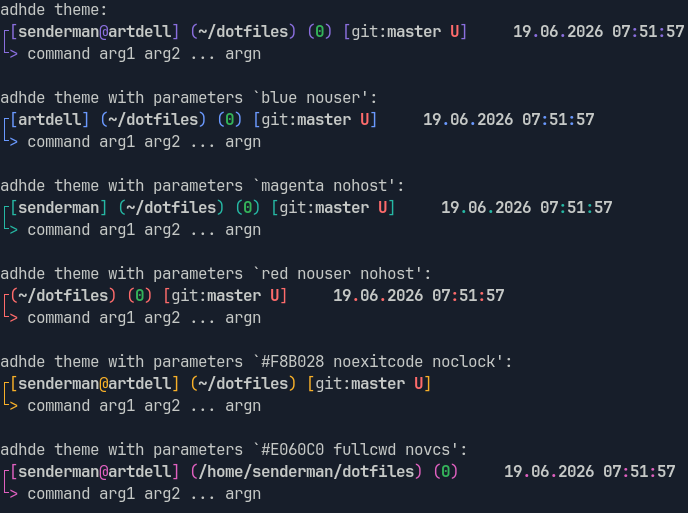

# ADHDE zsh theme

Zsh theme for [Attention Deficit Hyperactivity Desktop Environment](https://github.com/Senderman/adhde)



# Installation

## Plain zsh

Clone this repository to any location on your PC, then add to your `.zshrc`:

```bash
fpath+=(/path/to/cloned/repository)
autoload -Uz promptinit
promptinit
prompt adhde
```

To see all options of the theme (for example, to change the accent color or to hide user/host/vcs info/clock/etc), run:

```bash
prompt -h adhde
```

Then add to your `.zshrc`

```bash
prompt adhde blue novcs noclock
```


## With [Antidote](https://getantidote.github.io/)

Same as for plain zsh, but instead of modifying fpath directly, add the following line to your plugins file:

```
Senderman/adhde-zsh-theme kind:fpath
```

# Misc
Inspired by [OMZ's fox theme](https://github.com/ohmyzsh/ohmyzsh/blob/master/themes/fox.zsh-theme)

